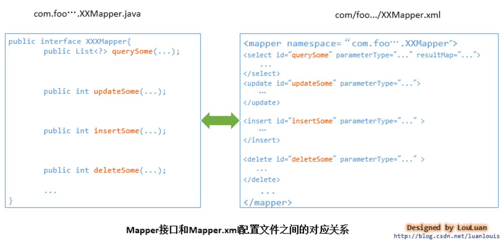
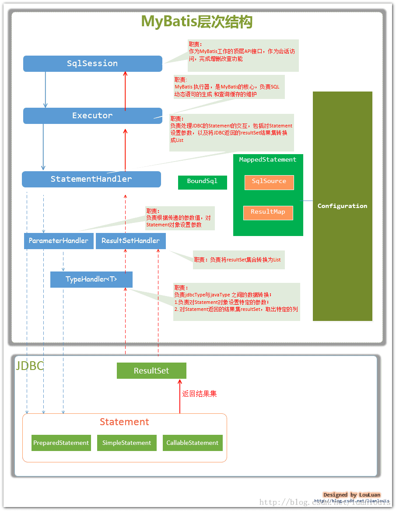

# MyBatis

架构图：

1. 接口层与数据库交互的方式
    - 使用传统的MyBatis提供的API：即传入`Statement Id` 和 查询参数 给SqlSession对象；由SqlSession对象与数据库交互；简单实用，但不符合面向对象的编程习惯。
    - 使用MyBatis支持接口调用方式：MyBatis把配置文件中的每一个`<mapper>`节点抽象为一个`Mapper`接口，接口中的方法，参数等也对应于各个子节点。通过`SqlSession.getMapper(xxxMapper.class)`方法就可以得到Mapper实例，从而实现交互。另外除了配置文件，还可以通过注解的方式实现调用。

2. 数据处理层
    - 参数映射和动态sql语句生成：jdbc与java对象之间的相互转化
    - 执行sql语句，并将封装查询结果继承List
3. 框架支持层
    - 事务管理
    - 连接池管理
    - 缓存管理
    - sql语句配置
4. 引导层
    - 基于XML配置文件
    - 基于Java API

主要组件及其相互关系

- `BoundSql`：动态生成的sql语句以及相应的参数信息
- `MappedStatement`：实际数据操作的节点的封装
- `Configuration`：MyBatis所有的配置信息
- `SqlSource`：根据用户传递的`parameterObject`动态生成sql语句，封装到`BoundSql`对象中，并返回

## 常用实践

1. `BoundSql`类：一个处理了动态执行的内容，实际上的SQL语句，包含了参数列表等。
    - `String getSql()`：返回存储的实际sql语句
    - `List<ParameterMapper> getParameterMapping()`：获取参数列表
    - `Object getParameterObject()`：获取参数信息
    - `boolean hasAdditionalParameter(String name)`：判断是否有额外的参数
    - `Object getAdditionalParameter(String name)`：获取额外的参数
2. `MetaObject`类：用于获取对象的元数据信息
    - `Object getValue(String name)`：获取对象的属性值
3. `SystemMetaObject`类：系统元数据对象
    - `MetaObject forObject(Object object)`：获取对象的元数据信息
4. `Configuration`类：获取配置信息
    - `MetaObject newMetaObject(Object object)`：获取对象的元数据信息
    - `TypeHandlerRegistry getTypeHandlerRegistry()`：获取类型处理器注册器
5. `TypeHandlerRegistry`类：类型处理器注册器
    - `boolean hasTypeHandler(Class<?> javaType)`：判断是否有对应的类型处理器
6. `ParameterMapping`类：参数映射
    - `String getProperty()`：获取参数名
    - `ParameterMode getMode()`：获取参数模式
7. `ParameterMode`类：参数模式
    - `IN`：输入参数
    - `OUT`：输出参数
    - `INOUT`：输入输出参数
8. `StatementHandler`接口：处理SQL语句的接口
    - `BoundSql getBoundSql()`：获取`BoundSql`对象
    - `ParameterHandler getParameterHandler()`：获取`ParameterHandler`对象
    1. `DefaultParameterHandler`类：参数处理器
    2. `MyBatisParameterHandler`类：MyBatis参数处理器
9. `Invocation`类：调用处理器
    - `Object getTarget()`：获取目标对象
    - `Object[] getArgs()`：获取参数列表
    - `Method getMethod()`：获取方法
10. `ResultSetHandler`接口：结果处理器
    - `List<E> handleResultSets(Statement stmt)`：处理结果集
    - `void handleOutputParameters(CallableStatement cs)`：处理输出参数
    - `Cursor<E> handleCursorResultSets(Statement stmt)`：处理游标结果集

## ResultSetHandler

将`StatementHandler`做的数据库连接、生成`Statement`、解析SQL参数，以及`ParameterHandler`做的参数映射处理，这些步骤生成的结果集进行处理，形成一个完整的SQL请求。
只有一个默认实现类`DefaultResultSetHandler`。
一般情况下，`ResultSetHandler`是在处理查询请求时由`Configuration`对象创建。

| 方法 | 说明 |
| --- | --- |
| `List<E> handleResultSets(Statement stmt)` | 处理结果集 |
| `void handleOutputParameters(CallableStatement cs)` | 处理存储过程中的输出参数 |
| `Cursor<E> handleCursorResultSets(Statement stmt)` | 批量处理结果集 |

## 注解

1. `@Intercepts`：拦截器注解。可以拦截：sql的构建`StatementHandler`、参数的处理`ParameterHandler`、结果的处理`ResultSetHandler`、sql内部执行器`Executor`。
    - `@Signature`：拦截器签名
        - `type`：拦截的对象，即以上类型
        - `method`：拦截的方法，拦截的对象的方法
        - `args`：拦截的参数，拦截的对象的方法的参数
