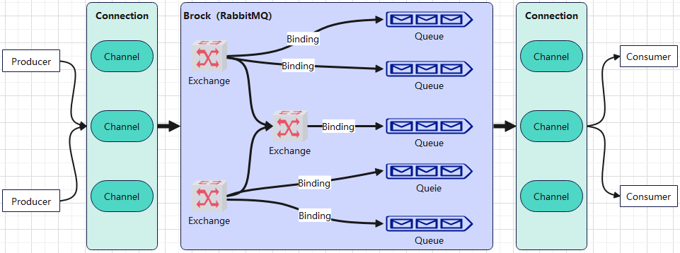

# Rabbitmq

RabbitMQ是实现AMQP消息队列和路由功能的进程，内部结构为多个Virtual Host虚拟机，虚拟机中有Exchange和Queue两个组件。 Exchange用于接收生产者发送的消息，Queue用于暂存指定服务器的还未被消费的消息，以备消费者订阅后，提供使用。自身采用Erlang编写。

> AMQP: Advanced Message Queuing Protocol，高级消息队列协议，是一个提供统一消息服务的应用层标准高级消息队列协议，是应用层协议的一个开放标准，为面向消息的中间件设计。
> MQ：Message Queue，消息队列，是一种应用程序对应用程序的通信方法，应用程序通过读写出入队列的消息（针对应用程序的数据）来通信，而无需专用连接来链接彼此。

## RabbitMQ组成

- Producer：消息生产者，负责发送消息。
- Consumer：消息消费者，负责接收消息。
- Exchange：消息交换机，负责接收生产者发送的消息，并根据路由规则将消息发送到指定的队列。
- Queue：消息队列，用于暂存还未被消费的消息。

## RabbitMQ工作流程

1. Producer：消息生产者
2. Connection：连接，TCP连接
3. Channel：信道，多路复用连接中的一条独立的双向数据流通道。是在Connection内部建立的逻辑连接，如果应用程序支持多线程，通常每个线程创建一个Channel，并且Channel之间完全隔离。
4. Broker：消息代理，即接收和分发消息的应用程序，RabbitMQ Server。
5. Exchange：交换机，接收生产者发送的消息，并根据路由规则将消息发送到指定的队列。当路由规则匹配不到队列时，根据mandatory参数决定消息的处理方式；如果为true，则返回给生产者，如果为false，则直接丢弃。
    类型有：direct、fanout、topic、headers。。。
    - direct：直连，将消息路由到BindingKey与RoutingKey完全匹配的队列。
    - fanout：广播式，将消息路由到所有与之绑定的队列。
    - topic：主题，将消息路由到BindingKey与RoutingKey模糊匹配的队列。规则：*：匹配一个单词，#：匹配多个单词；多个单词之间用.分隔。
6. Binding：绑定，Exchange和Queue之间的虚拟连接，可以将多个Queue绑定到一个Exchange上。
    - RoutingKey：路由键，Exchange根据RoutingKey将消息路由到指定的Queue。
    - BindingKey：绑定键，Exchange与Queue之间的绑定规则。
7. Queue：消息队列，用于暂存还未被消费的消息。
8. Consumer：消息消费者
    > 消息确认：通过autoAck参数控制消息确认方式
    > - autoAck=true：自动确认，消息一旦成功发送认为已被消费
    > - autoAck=false：手动确认，需要消费者手动调用ack方法确认消息

## 死信队列

死信队列（Dead Letter Exchanges）是RabbitMQ的一个重要特性，用于处理消息消费失败的情况。当消息被拒绝且无法重回、过期或队列达到最大长度时，消息将被发送到死信队列中。

## Java Client

1. Connection：
   1. 创建实例：`Connection connection = factory.newConnection();`
   2. 常用方法：
        - `Channel createChannel()`：创建信道
        - `void close()`：关闭连接
2. ConnectionFactory
   1. 创建实例：`ConnectionFactory factory = new ConnectionFactory();`
   2. 设置参数：
        - `void setHost(String host)`：设置主机地址
        - `void setPort(int port)`：设置端口号
        - `void setUsername(String username)`：设置用户名
        - `void setPassword(String password)`：设置密码
        - `void setVirtualHost(String virtualHost)`：设置虚拟主机
   3. 创建连接：`Connection connection = factory.newConnection();`
