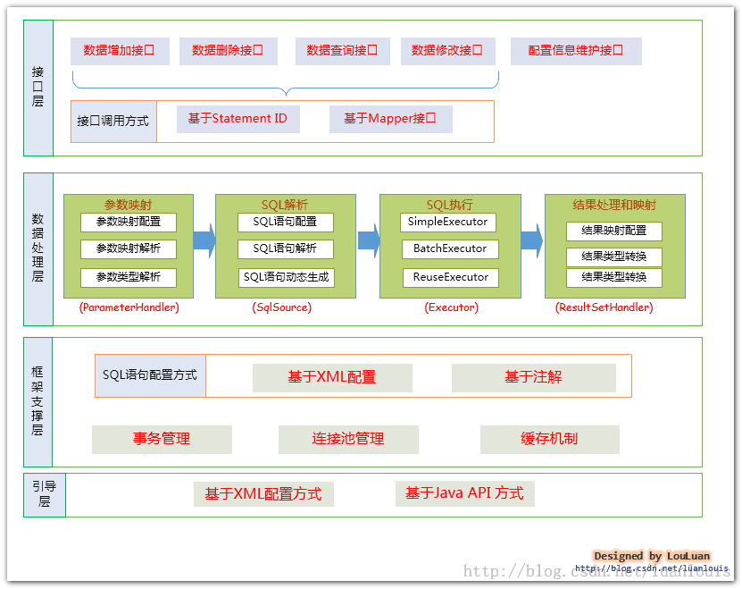
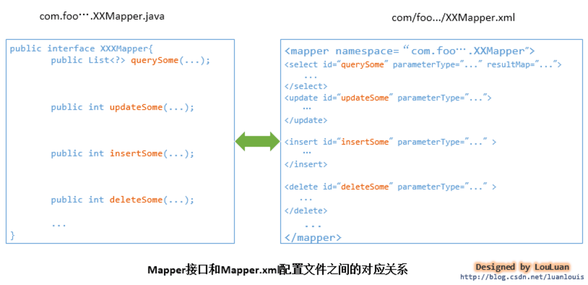
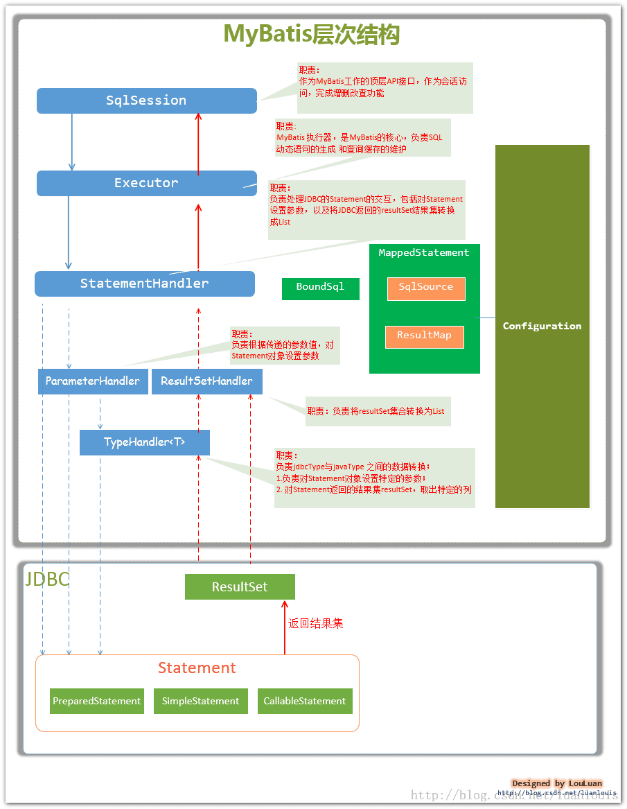

# MyBatis

架构图：

1. 接口层与数据库交互的方式
    - 使用传统的MyBatis提供的API：即传入`Statement Id` 和 查询参数 给SqlSession对象；由SqlSession对象与数据库交互；简单实用，但不符合面向对象的编程习惯。
    - 使用MyBatis支持接口调用方式：MyBatis把配置文件中的每一个`<mapper>`节点抽象为一个`Mapper`接口，接口中的方法，参数等也对应于各个子节点。通过`SqlSession.getMapper(xxxMapper.class)`方法就可以得到Mapper实例，从而实现交互。另外除了配置文件，还可以通过注解的方式实现调用。

2. 数据处理层
    - 参数映射和动态sql语句生成：jdbc与java对象之间的相互转化
    - 执行sql语句，并将封装查询结果继承List
3. 框架支持层
    - 事务管理
    - 连接池管理
    - 缓存管理
    - sql语句配置
4. 引导层
    - 基于XML配置文件
    - 基于Java API

主要组件及其相互关系

- `BoundSql`：动态生成的sql语句以及相应的参数信息
- `MappedStatement`：实际数据操作的节点的封装
- `Configuration`：MyBatis所有的配置信息
- `SqlSource`：根据用户传递的`parameterObject`动态生成sql语句，封装到`BoundSql`对象中，并返回

## 常用实践

1. `BoundSql`类：一个处理了动态执行的内容，实际上的SQL语句，包含了参数列表等。
    - `String getSql()`：返回存储的实际sql语句
    - `List<ParameterMapper> getParameterMapping()`：获取参数列表
    - `Object getParameterObject()`：获取参数信息
    - `boolean hasAdditionalParameter(String name)`：判断是否有额外的参数
    - `Object getAdditionalParameter(String name)`：获取额外的参数
2. `MetaObject`类：用于获取对象的元数据信息
    - `Object getValue(String name)`：获取对象的属性值
3. `Configuration`类：获取配置信息
    - `MetaObject newMetaObject(Object object)`：获取对象的元数据信息
    - `TypeHandlerRegistry getTypeHandlerRegistry()`：获取类型处理器注册器
4. `TypeHandlerRegistry`类：类型处理器注册器
    - `boolean hasTypeHandler(Class<?> javaType)`：判断是否有对应的类型处理器
5. `ParameterMapping`类：参数映射
    - `String getProperty()`：获取参数名
    - `ParameterMode getMode()`：获取参数模式
6. `ParameterMode`类：参数模式
    - `IN`：输入参数
    - `OUT`：输出参数
    - `INOUT`：输入输出参数
7. `StatementHandler`接口：处理SQL语句的接口
    - `BoundSql getBoundSql()`：获取`BoundSql`对象
    - `ParameterHandler getParameterHandler()`：获取`ParameterHandler`对象
    1. `DefaultParameterHandler`类：参数处理器
    2. `MyBatisParameterHandler`类：MyBatis参数处理器
8. `Invocation`类：调用处理器
    - `Object getTarget()`：获取目标对象
    - `Object[] getArgs()`：获取参数列表
